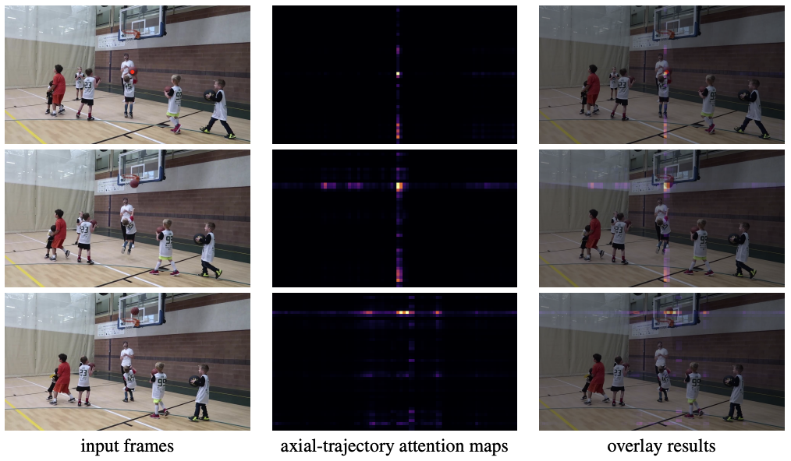
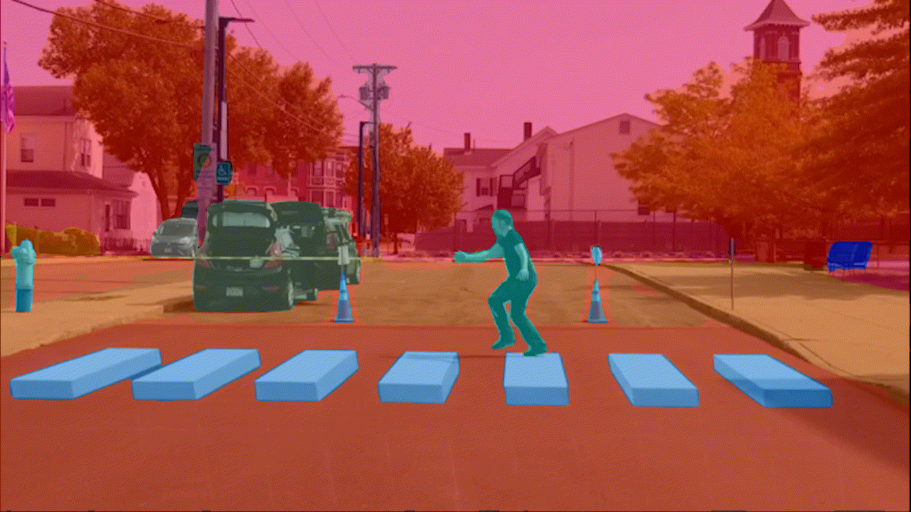

# (TMLR) A Simple Video Segmenter by Tracking Objects Along Axial Trajectories

This repo contains the code for our paper [**A Simple Video Segmenter by Tracking Objects Along Axial Trajectories**](https://arxiv.org/abs/2311.18537).

*Note*: We update our model name from MaXTron to Axial-VS in the TMLR version to better reflect the key innovations in our paper. To keep minimal change in the released codebase, we still maintain the usage of MaXTron below.

*MaXTron* is a simple yet effective unified meta-architecture for video segmentation, which enriches existing clip-level segmenters by introducing a within-clip tracking module and a cross-clip tracking module, thus achieving better temporally consistent segmentation results.

<div align="center">
  
</div><br/>

## Getting Started

For detailed usage of MaXTron, see

[MaXTron w/ Video-kMaX](MaXTron_Video-kMaX/README.md)

[MaXTron w/ Tube-Link](MaXTron_Tube-Link/README.md)

## Demos





## <a name="Citing MaXTron"></a>Citing  MaXTron

If you use MaXTron (Axial-VS) in your research, please use the following BibTeX entry.

```BibTeX
@article{hesimple,
  title={A Simple Video Segmenter by Tracking Objects Along Axial Trajectories},
  author={He, Ju and Yu, Qihang and Shin, Inkyu and Deng, Xueqing and Yuille, Alan and Shen, Xiaohui and Chen, Liang-Chieh},
  journal={Transactions on Machine Learning Research}
}
```

## Acknowledgement

[kMaX-DeepLab](https://github.com/bytedance/kmax-deeplab)

[Tube-Link](https://github.com/lxtGH/Tube-Link)
